# 📱 Nicestart – Android App

Nicestart es una aplicación Android con una interfaz moderna, soporte para múltiples idiomas y adaptación automática al modo claro y oscuro del sistema.

---

## 🚀 Preview de la App

### Pantallas principales

| Icono | Splash | Login | Login (Horizontal) |
|------|--------|-------|--------------------|
| 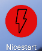 | 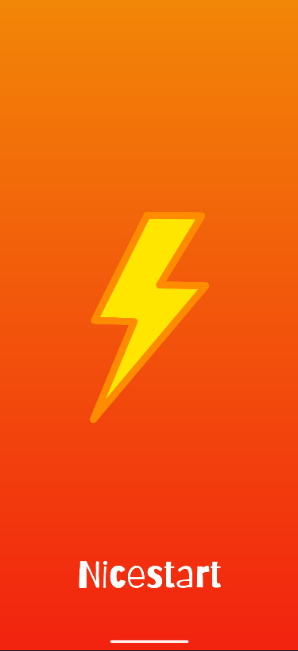 | 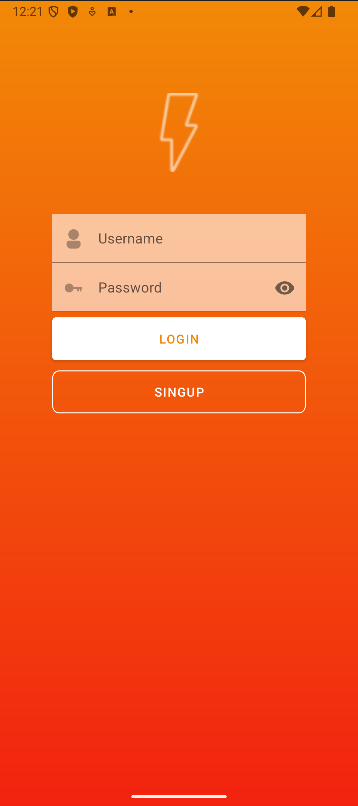 | 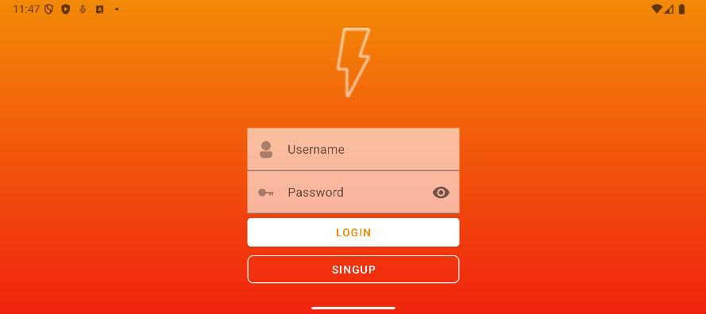 |

---

### Otras pantallas

| SignUp | Profile | Main |
|-------|---------|------|
| 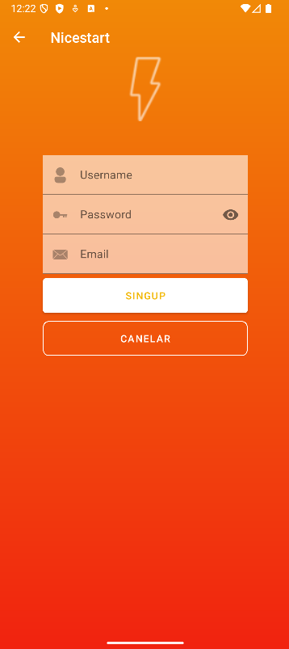 | 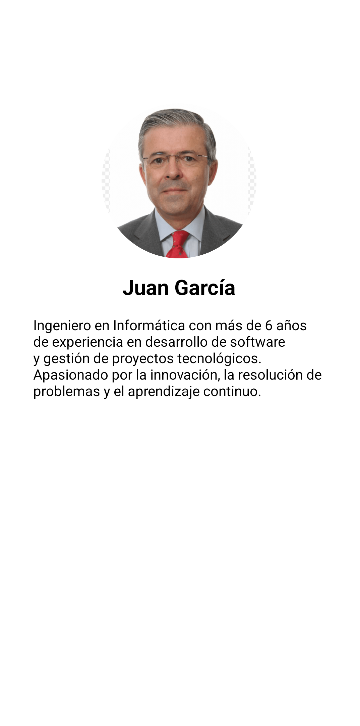 | 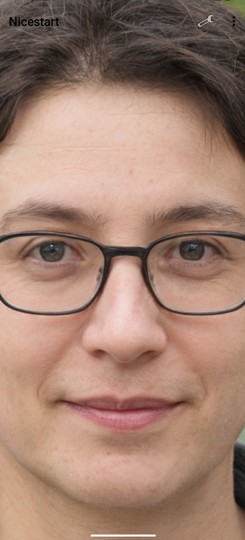 |

---

## 🧩 Funcionalidades del MainActivity

| Funcionalidad | Preview |
|--------------|---------|
| Settings (sin funcionalidad actual) |  |
| Botón AlertDialog | 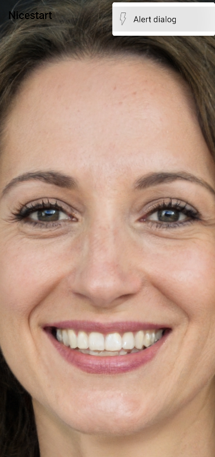 |
| AlertDialog con opciones | 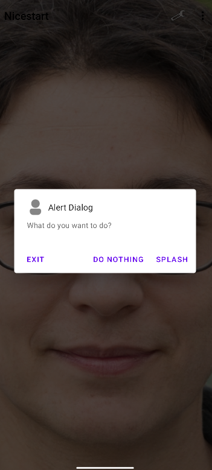 |
| SwipeRefresh (cambio de fondo) | 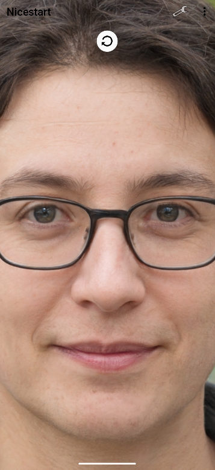 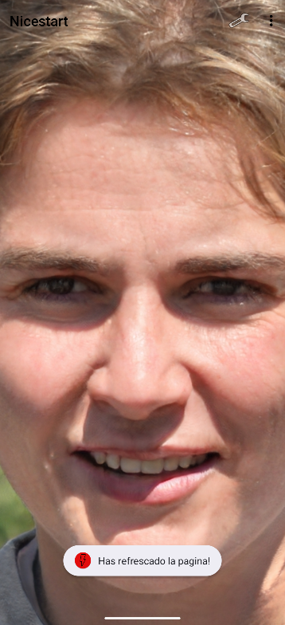 |
| Copy & Download con Toast | 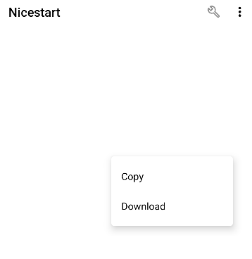 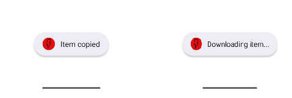 |

---

## 🌍 Internacionalización

Disponible en **español** e **inglés**, según el idioma configurado en el dispositivo.

---

## 🌗 Modo Claro / Oscuro

Soporte completo para **tema claro y oscuro**, adaptándose automáticamente al sistema.

---

## 📄 Licencia

Este proyecto está bajo la licencia  
[Creative Commons Attribution-ShareAlike 4.0 International](https://creativecommons.org/licenses/by-sa/4.0/)
